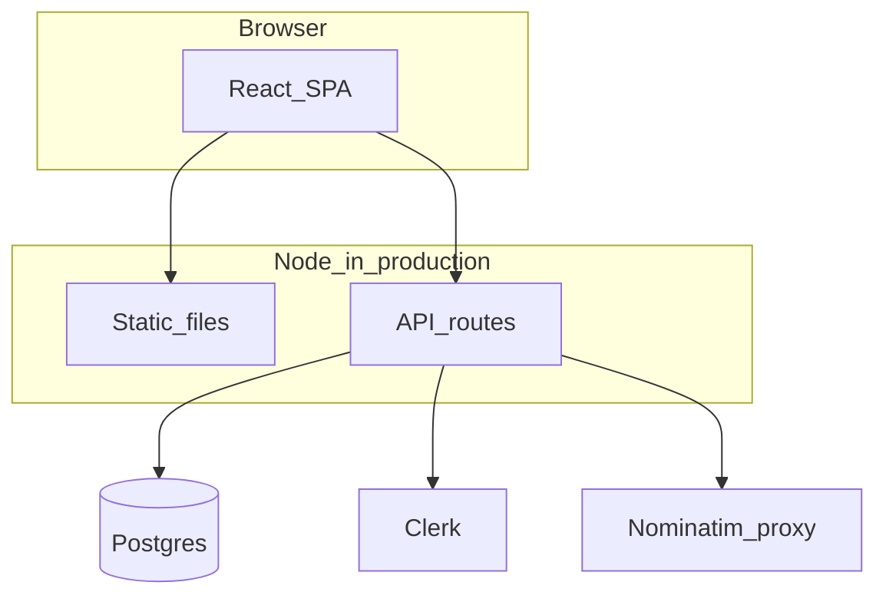

# NearFix

NearFix is a demo-style **hyperlocal services marketplace** for India: browse providers, filter by area and category, book a slot, and explore customer and provider dashboards. Authentication is powered by **Clerk**; data for bookings and profiles lives in **Postgres** via **Drizzle**.

**Repository:** [github.com/tarunkauxhik/NearFix](https://github.com/tarunkauxhik/NearFix)

---

## Features

- Marketing home, service discovery, and provider detail pages  
- Clerk sign-in / sign-up and post-auth routing  
- Booking flow (UI) and confirmation  
- Resident and provider dashboards  
- Admin area for user management (role-gated)  
- Server-backed geocode helpers for location-aware discovery (“near me”)  
- REST-style **`/api/*`** routes next to the Vite dev server in development, and one Node server in production  

---

## Tech stack

React 19 · TypeScript · Vite 6 · React Router 7 · Tailwind CSS · Radix/shadcn-style UI · TanStack Query · Clerk · Express (file-based API via `vite-plugin-api-routes`) · Drizzle ORM · Postgres · Vitest · ESLint  

---

## Quick start

```bash
git clone https://github.com/tarunkauxhik/NearFix.git
cd NearFix
cp env.example .env
# Edit .env: set DATABASE_URL, VITE_CLERK_PUBLISHABLE_KEY, CLERK_SECRET_KEY
npm install
npm run dev
```

Open **http://localhost:5173** (unless you set `PORT` / `HOST` in `.env`).

---

## Architecture



The browser calls **`/api/...`** on the same origin. Production runs **`npm run build`** then **`npm start`**, which serves the built client and mounts the API on the same process (see [`scripts/run-prod.mjs`](scripts/run-prod.mjs)).

---

## Environment variables

**Required for local dev:** `DATABASE_URL`, `VITE_CLERK_PUBLISHABLE_KEY`, `CLERK_SECRET_KEY`.

**Common for production:** same three, plus `VITE_PUBLIC_URL` (your public `https://` site URL) for Clerk-related server checks. Optional: `NOMINATIM_EMAIL` / `NOMINATIM_USER_AGENT`, admin bootstrap (`ADMIN_EMAILS`, `ADMIN_USERNAMES`, or `ADMIN_USER_IDS`), and dev-only CORS/host helpers documented in [`env.example`](env.example).

Copy [`env.example`](env.example) to `.env` and fill in values—**never commit `.env`**.

---

## Database

Schema lives in [`src/server/db/schema.ts`](src/server/db/schema.ts). With `DATABASE_URL` set in `.env`:

```bash
npx drizzle-kit push
```

Generate SQL migrations when you prefer versioned files: `npx drizzle-kit generate` (see [Drizzle Kit](https://orm.drizzle.team/kit-docs/overview)).

---

## Scripts

| Command | Description |
| --- | --- |
| `npm run dev` | Vite + API routes (development) |
| `npm run build` | Production client + server bundle |
| `npm start` | Run production server (after `build`) |
| `npm run preview` | Preview client build via Vite |
| `npm run type-check` | TypeScript check |
| `npm run lint` | ESLint |
| `npm run test` | Vitest |

---

## Deploy (short)

1. Set the same environment variables on your host as in `.env` (especially Clerk and `DATABASE_URL`).  
2. Run **`npm ci`** (or **`npm install`**) then **`npm run build`**.  
3. Start with **`npm start`** (binds using `PORT` / `SERVER_*` as documented in `env.example`).  

Use your provider’s docs (e.g. [Render](https://render.com/docs), [Railway](https://docs.railway.app)) for Git integration, HTTPS, and secrets.

---

## License

MIT — see [LICENSE](LICENSE).
